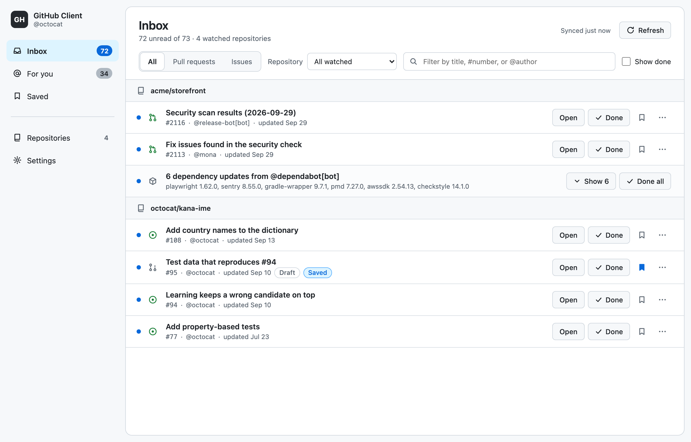
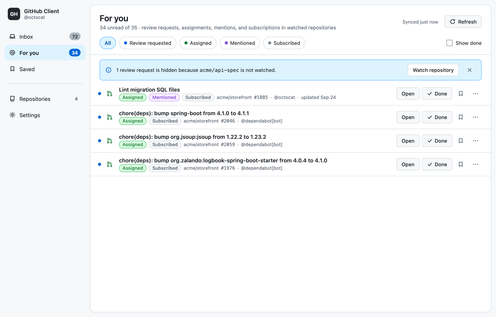
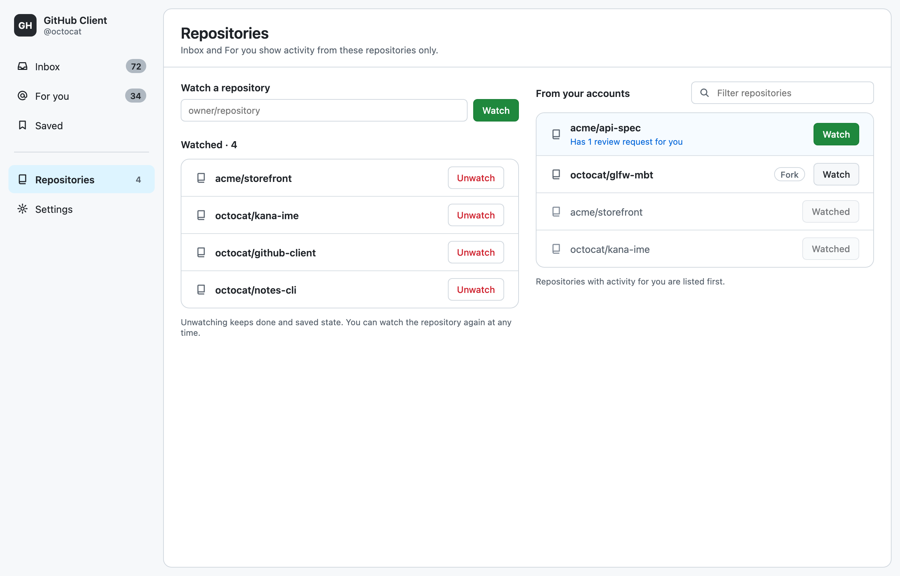
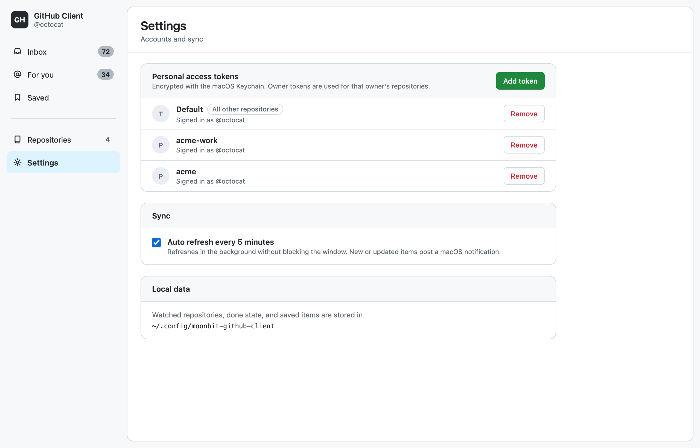
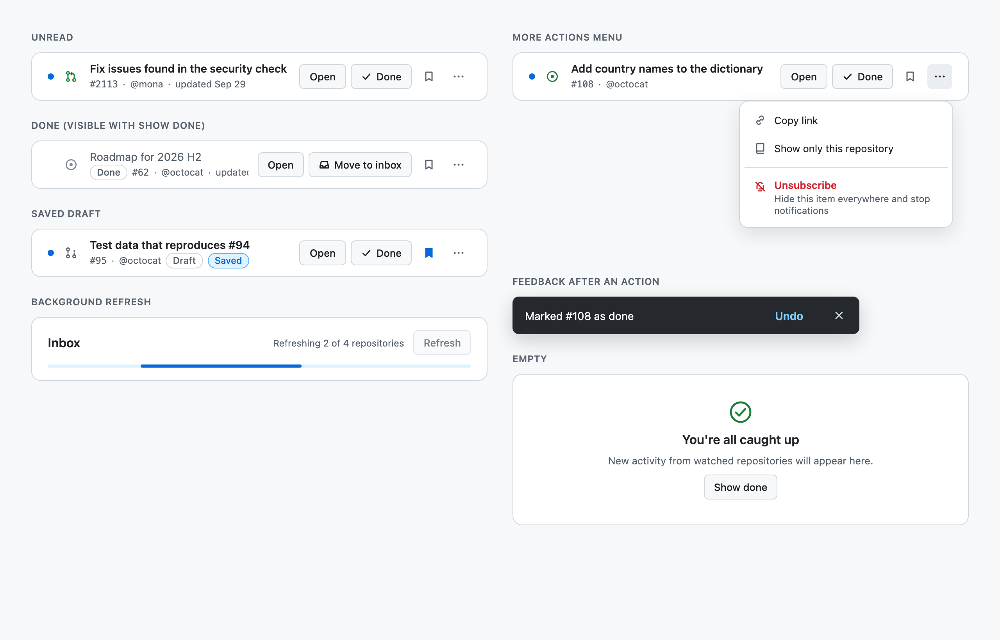
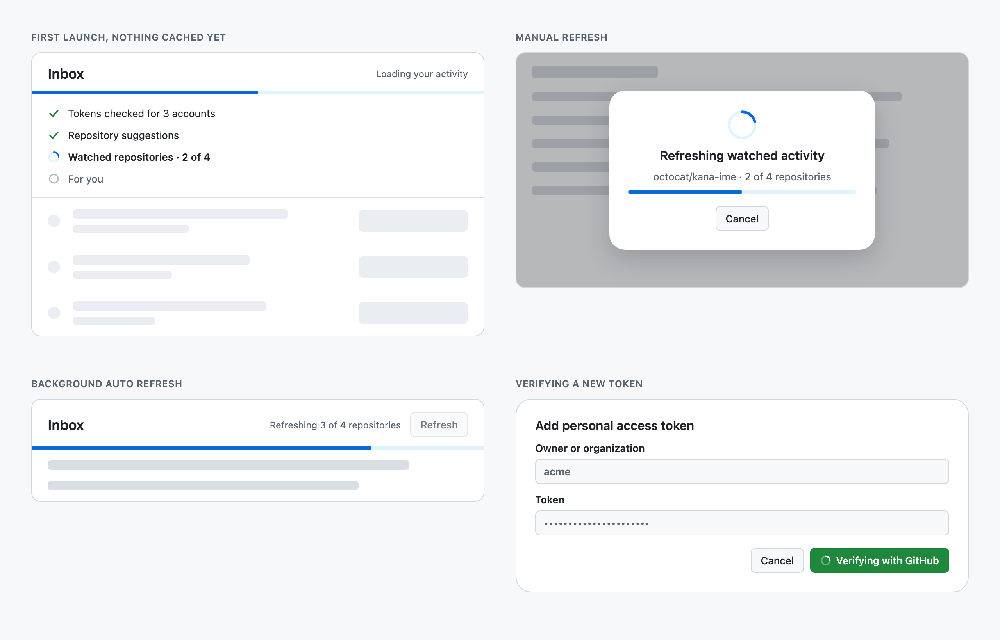
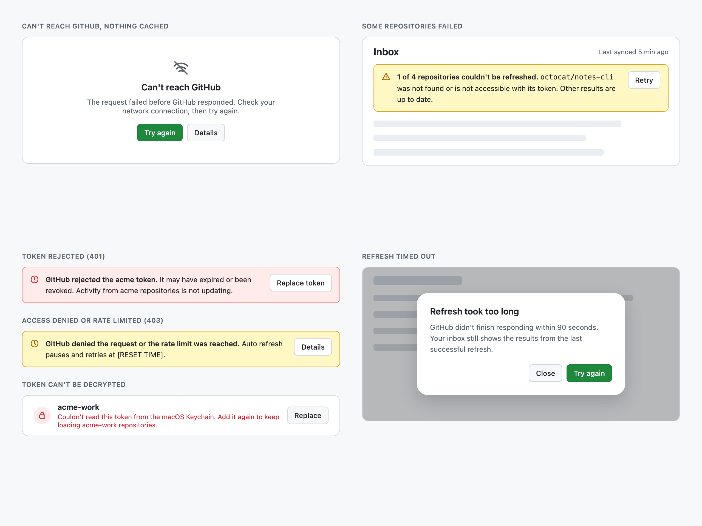

# github-client

[English](README.md) | 日本語

MoonBitで実装するネイティブデスクトップ向けGitHubクライアントです。

このプロジェクトでは、WebViewを主UIにせず、GLFWとネイティブ描画を使う構成に挑戦します。WindowsとmacOSで動作します。

## Status

GLFWを製品window hostとして採用し、OpenGL 3 + Dear ImGuiを接続する方針です。選定理由は[ADR 0001](docs/decisions/0001-glfw-ui-stack.md)、調査全体は[技術調査](docs/technical-research.md)を参照してください。

## Related repositories

- [`tanabe1478/glfw-mbt`](https://github.com/tanabe1478/glfw-mbt) — Windows向け修正を蓄積するfork
- [`mizchi/glfw-mbt`](https://github.com/mizchi/glfw-mbt) — upstream

## Stack

- Window/input: [`tanabe1478/glfw-mbt`](https://github.com/tanabe1478/glfw-mbt)
- GUI: Dear ImGui公式GLFW backend（GitHub Primer light paletteを基準にした独自theme）
- Native renderer: OpenGL 3（初期経路）
- UI verification: Pure MoonBit state test + application semantic registry + screenshot
- GitHub API: 必要なREST endpointだけを`github_api/`へ実装
- Async runtime: `moonbitlang/async`
- Secure token storage: `moonbit-community/proton_safe_storage`
- Open external URLs: `moonbit-community/proton_shell`
- Packaging: `moonbit-community/proton_package`

登録repository、mention、dependency activityの関連付けは[Product scope](docs/product-scope.md)、依存方向は[Module boundaries](docs/module-boundaries.md)、Jasperとの比較は[Jasper feature gap analysis](docs/jasper-feature-gap.md)を参照してください。

Kaguraはゲームエンジンなので採用しません。特定作者に寄せず、MoonBitコミュニティ全体のパッケージを比較します。

## Screens

画面はClaude Designのcanvas「GitHub Client Redesign」で設計し、native implementationはそれに沿って描画しています。以下はcanvasのartboardを描画した画像です。実装の画面とは細部（font、余白、件数など）が異なり、実装の証跡は`artifacts/`のscreenshotです。

| Inbox | For you |
|---|---|
|  |  |

- Inbox: Watch中のrepositoryのopen pull request / issueをrepositoryごとに表示します。kind、repository、textで絞り込み、dependency botの更新は1行にまとめます。
- For you: review依頼（team宛てを含む）、assign、mention、購読を理由のchip付きで表示し、理由で絞り込めます。Watchしていないrepositoryに隠れたreview依頼はbannerで知らせます。
- 各行の操作は常に見えるbuttonです。`Open`、`Done`、Save、More actions（Copy link、Show only this repository、Unsubscribe）を置き、Done / Save / UnsubscribeはsnackbarのUndoで取り消せます。

| Repositories | Settings |
|---|---|
|  |  |

| 行の状態とfeedback | Loading |
|---|---|
|  |  |



- Loading: 初回起動はskeleton、手動Refreshは進捗とCancel付きのdialog、自動更新は画面を止めない線形barです。
- Errors: token拒否（401）、rate limit（403）、一部repositoryの失敗、GitHubに届かない場合、timeoutを、原因と直すためのbutton付きで表示します。

画面一覧と各状態の仕様は[`docs/screens.md`](docs/screens.md)にあります。画像は`scripts/design/render-design.cjs`でcanvasのartboardから再生成できます。

## Done、Save、Unsubscribeの違い

Doneは「今の状態までは見た」、Unsubscribeは「この項目自体をもう見ない」という操作です。

| | Done | Unsubscribe |
|---|---|---|
| 押した直後 | 一覧から消える（Show doneで見える） | Savedを含むすべての一覧から消える |
| GitHubで更新があったとき | 未読に戻って再び表示される | 消えたまま |
| 通知 | 次の更新で届く | 届かない |
| 戻し方 | Show doneをオンにして`Move to inbox` | snackbarの`Undo`か`ghclient unmute <url>`。Unsubscribeした項目を一覧する画面はない |
| GitHub側への影響 | なし | なし（GitHubの購読はそのまま） |

SaveはDoneかどうかに関係なく項目をSavedに残します。

「今は対応しないが、やるときに対応する」項目は、SaveしてからDoneにします。InboxとFor youからは消え、Savedには外すまで残り、GitHubで動きがあれば未読に戻ります。動いたときに気づければよいだけならDoneだけで足ります。Unsubscribeは二度と見なくてよい項目に使います。

## Modules

- `modules/domain`: Pureなproduct modelとrelevance rule
- `modules/github_api`: 最小GitHub API surface
- `modules/app_paths`: OS別application data path
- `modules/credential_store`: DPAPI/KeychainによるPAT暗号化保存（`default`とowner/organization scopeの複数トークンに対応）
- `modules/repository_store`: 登録repositoryのfilesystem persistence
- `modules/read_state_store`: activityの未読・既読状態のfilesystem persistence
- `modules/triage_store`: 保存（Saved）とミュートのfilesystem persistence
- `modules/review_request_store`: team宛てのreview依頼が外れたあともreviewするまで残すためのURL記録
- `modules/activity_sync`: GitHub activityの取得（並列取得、token選択）とdomain itemへの変換。desktopとCLIで共有
- `cmd/github_client`: desktop composition root
- `cmd/ghclient`: command-line client

module間の循環参照は禁止し、依存方向は[Module boundaries](docs/module-boundaries.md)で固定します。

## Command-line client

`ghclient`はwindowを開かずにappと同じtokenとdataを使い、一覧の取得（JSON出力）とDone / Save / Mute / Watchの変更を行います。scriptやAI agentからの自動化向けです。起動中のappは変更を約2秒で読み直します。

```sh
./scripts/macos/install-cli.sh
ghclient inbox --kind pr --json
ghclient done https://github.com/owner/repo/pull/123
```

commandとJSONの形式は[`docs/cli.md`](docs/cli.md)を参照してください。

## Windows bootstrap

前提条件はLLVM、Visual Studio Build Tools、vcpkg版GLFWです。

```powershell
winget install --id LLVM.LLVM -e
$env:VCPKG_ROOT = "$HOME\vcpkg"
& "$env:VCPKG_ROOT\vcpkg.exe" install glfw3:x64-windows-static
.\scripts\windows\run.ps1
```

ビルドのみの場合は`.\scripts\windows\run.ps1 -BuildOnly`を使用します。GitHub Primer風themeを含む実画面をartifactとして確認できます。既読状態は`%LOCALAPPDATA%\MoonBitGitHubClient\read-state.txt`へ保存されます。

```powershell
.\scripts\windows\run.ps1 -BuildOnly
.\scripts\windows\capture-smoke.ps1
.\scripts\windows\capture-smoke.ps1 -Page ForYou -Output artifacts\for-you\for-you.png
.\scripts\windows\interaction-smoke.ps1
```

`interaction-smoke.ps1`は実際のWindows windowを起動し、Settings navigationと操作後のscreenshotを検証します。

## macOS bootstrap

前提条件はXcode Command Line Tools、Homebrew版GLFW、miseです。MoonBit toolchainは`mise.toml`にpinしてあり、`mise install`がtoolchainとcoreを展開します。

```sh
xcode-select --install
brew install glfw
git submodule update --init
./scripts/macos/run.sh
```

ビルドのみの場合は`./scripts/macos/run.sh --build-only`を使用します。既読状態は`~/.config/moonbit-github-client/read-state.txt`へ保存されます。

```sh
./scripts/macos/run.sh --build-only
./scripts/macos/capture-smoke.sh --page Settings --output artifacts/macos/settings.png
```

`capture-smoke.sh`はcontrol file経由でnavigationを実行し、`screencapture -l`で撮影します。windowを前面に出さず、focusもcursorも動かさないため、作業中のappを邪魔せずに検証できます。権限はscreen recordingのみ必要です。

### Control file

起動中のappは`~/.config/moonbit-github-client/control.txt`を約0.5秒ごとに監視し、書き込まれたコマンドをUI操作と同じhandlerで実行します。fileは読み込み後に削除されます。`scripts/macos/ctl.sh`が送信interfaceです。

```sh
./scripts/macos/ctl.sh nav for-you
./scripts/macos/ctl.sh save https://github.com/owner/repo/pull/123
./scripts/macos/ctl.sh done https://github.com/owner/repo/issues/123
./scripts/macos/ctl.sh unsub https://github.com/owner/repo/pull/123
./scripts/macos/ctl.sh open https://github.com/owner/repo/pull/123
./scripts/macos/ctl.sh refresh
./scripts/macos/ctl.sh quit
```

利用可能なcommandは`./scripts/macos/ctl.sh`を引数なしで実行すると表示されます。`capture-smoke.sh --cmd 'save <url>'`で任意のcommandを撮影前に送信できます。ImGuiのcontrolはOSのaccessibility treeに露出しないため、この仕組みがUIの決定的な自動操作経路になります。

## macOS app bundle

`./scripts/macos/package-app.sh`がrelease buildを作成し、`MoonBit GitHub Client.app`として`/Applications`へinstallします。bundleはlibglfwを同梱し、署名はad-hocです。install先を変える場合は`INSTALL_DIR`を指定してください。

```sh
./scripts/macos/package-app.sh
INSTALL_DIR=~/Applications ./scripts/macos/package-app.sh
```

ad-hoc署名なのでこのmachineではそのまま起動できますが、他のmachineではGatekeeperにblockされます。配布する場合はDeveloper ID署名が必要です。
